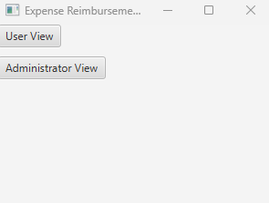
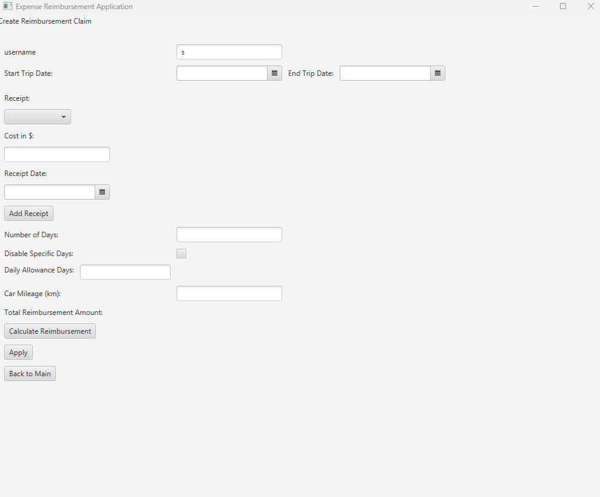
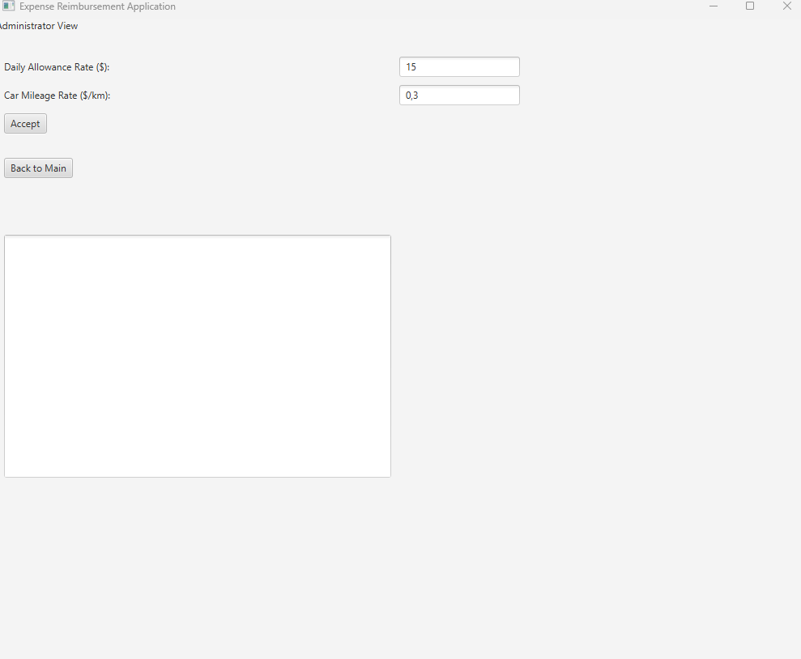
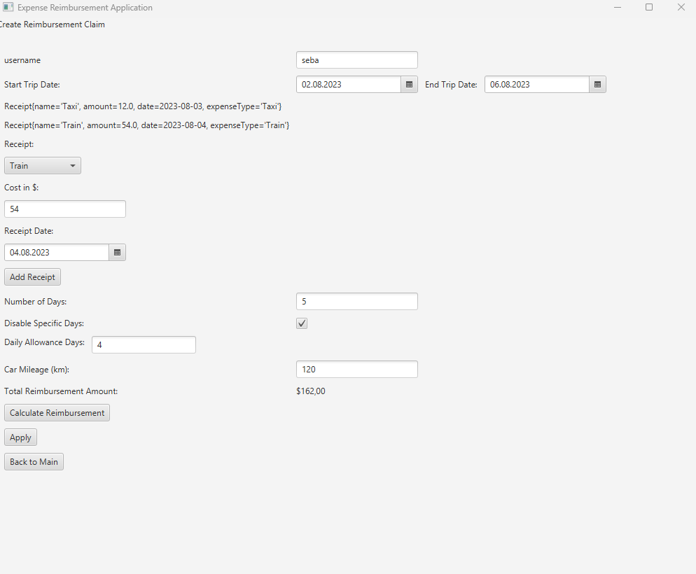
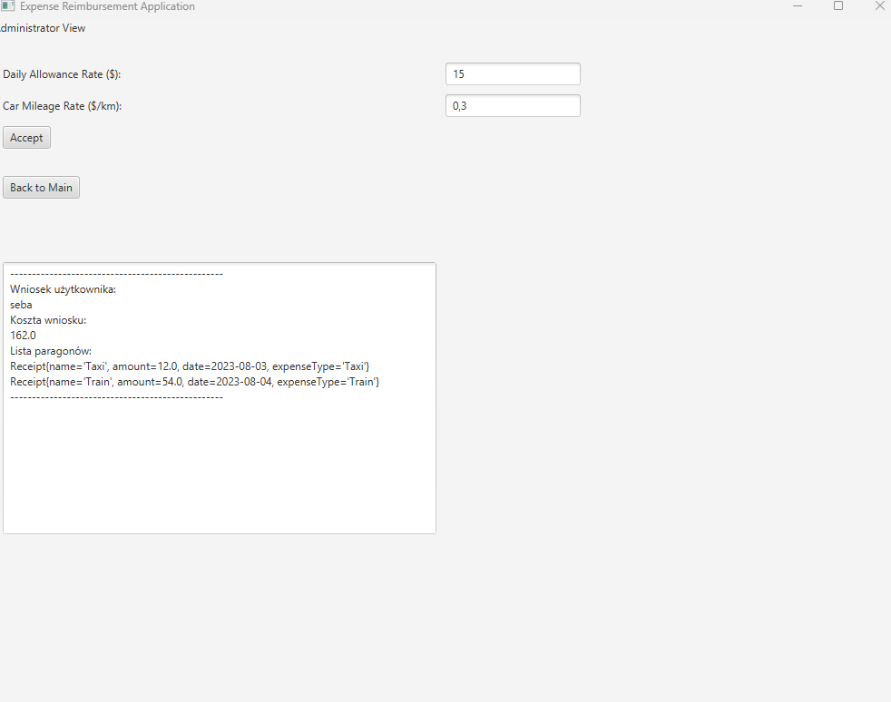

# Recruitment_Task
This is a simple Expense Reimbursement Application built using JavaFX.

## How to Run

1. Make sure you have Java installed on your machine.

2. Clone the repository: git clone https://github.com/Blejn/Recruitment_Task.git

3. Navigate to the project directory:
4. Compile the code: Replace `/path/to/javafx-sdk-17` with the actual path to your JavaFX SDK.
5. Run the application
6. The application should launch, showing the main menu with options for User View and Administrator View.

## User View

In the `UserView` class, users can create a new reimbursement claim by following these steps:

1. Enter your username in the `usernameField`.
2. Select the start and end dates of your trip using the date pickers.
3. Add receipts by selecting the type and entering the cost.
4. Optionally, disable specific days for daily allowance calculation using the checkbox.
5. Enter car mileage if applicable.
6. Click the "Calculate Reimbursement" button to calculate the reimbursement amount.
7. Click the "Apply" button to submit your claim.

## Administrator View

In the `AdminView` class, administrators can review and manage reimbursement claims:

1. Log in as an administrator.
2. Review the list of reimbursement applications.
3. Approve or reject claims based on their details.

## Dependencies

- JavaFX 11
## Screen
Start page

User View

Admin View

User completed form and applied

After user completed form and applied check AdminView

## Author

- Blejn

## License

This project is licensed under the MIT License - see the [LICENSE](LICENSE) file for details.

